```mermaid
graph TD
    sys["sys (root)"]
    math["math"]
    ai["ai"]
    text["text"]
    geo["geo"]
    astro["astro"]
    fin["fin"]
    bsm["bsm (extends fin)"]
    chart["chart"]
    data["data"]
    rex["rex"]
    algo["algo"]
    tcp["tcp"]
    thread["thread (handle)"]
    www["www"]
    cdn["cdn (extends www)"]
    nlp["nlp"]
    bev["bev"]
    file["file"]
    zip["zip"]
    img["img"]
    cpp["cpp"]
    itr["itr"]
    k3s["k3s"]
    vm["vm"]
    mobl["mobl"]
    trek["trek"]
    seo["seo"]
    drvr["drvr"]
    art["art"]
    go["go"]
    ruby["ruby"]
    node["node"]
    rust["rust"]
    python["python"]
    cython["cython"]

    sys --> math
    sys --> ai
    sys --> text
    sys --> geo
    sys --> astro
    sys --> fin
    fin --> bsm
    sys --> chart
    sys --> data
    sys --> rex
    sys --> algo
    sys --> tcp
    sys --> thread
    sys --> www
    www --> cdn
    sys --> nlp
    sys --> bev
    sys --> file
    sys --> zip
    sys --> img
    sys --> cpp
    sys --> itr
    sys --> k3s
    sys --> vm
    sys --> mobl
    sys --> trek
    sys --> seo
    sys --> drvr
    sys --> art
    sys --> go
    sys --> ruby
    sys --> node
    sys --> rust
    sys --> python
    sys --> cython
```

# Gem Language Mindmap

**Version:** 0.1.0 | **Date:** 2026-04-16 | **Copyright:** David B Hon 2025, 2026

```mermaid
mindmap
  root((Gem))
    Keywords
      fun
      obj
      use
      if
      else
      while
      end
      alias
      his
      lib
      exit
      quit
      langport
    Literals
      true
      false
      null
      nil
      nan
    Types
      int
      double
      string
      bool
      _global
    Builtin Functions
      isnil x
      isnan x
      tonum x
      tostr x
      len x
      type x
    Operators
      Arithmetic + - * /
      Compound += -= *= /=
      Comparison == != > >= < <=
      Logical ! && ||
      Separator ; multi-stmt
      String concat +
    Scope
      Local no underscore
      Global underscore prefix
      Object attr dot prefix
      Parent attr dotdot prefix
    Help System
      help topic
      helpfull write md open
      helpless write md pipe less
      Topics keywords
      Topics builtins
      Topics concepts for return scope
    System
      sys
        print args async exec
        help helpfull helpless doc host
        exit langport redirect app
      math
        sin cos sqrt pi
        diff integrate simplify solve
        sym_latex to_latex write_latex
        read_latex parse_latex compile_latex
        useSymPy useSage
      ai
        prompt prompt_native
        useMistral useOllama useGemini
        setKey setHost setPath
        provider model host
      text
        read sub replace
        write_pdf write_pdf_a read_pdf
        read_markdown write_markdown
        read_yaml write_yaml
        read_html write_html
        read_xml write_xml
        read_fits_header read_hdf_header
    Science
      astro
        Constants G c AU pc ly
        Constants Msun Rsun Lsun H0
        Unit to_ly to_pc to_au deg_to_rad
        Stellar luminosity stefan_boltzmann wien
        Stellar abs_magnitude spectral_class
        Stellar schwarzschild_radius escape_velocity
        Orbital orbital_period orbital_velocity
        Orbital hill_sphere roche_limit synodic_period
        Orbital planet Mercury to Neptune
        Solar solar_flux solar_wind_pressure
        Solar sunspot_cycle parker_spiral_angle
        Solar solar_activity
        Cosmology hubble_distance redshift_velocity
        Cosmology lookback_time critical_density
        Coords equatorial_to_galactic angular_separation
        Exoplanet transit_depth habitable_zone equilibrium_temp
        Pulsar pulsar_spindown age Bfield edot
      geo
        lookup lat lon city country
        distance Haversine km
        write_geojson history tectonic AI
        plot2d Plotly OSM
        plot3d globe orthographic
      bev
        data fit_line param
        Bevington least squares
      data
        read_csv mean std
    Finance
      fin
        ticker price volume open high low
        ticker pe_ratio market_cap dividend_yield
        high_yield_bonds etfs equities top50
        dashboard port 8082
        bs_price European option NPV
        greeks delta gamma theta vega
        date calendar is_holiday add_days diff_days
      bsm extends fin
        price_american PDE weekly monthly quarterly
    Web and Network
      www
        app background HTTP server
        wget curl download
        redirect 302 server
        map2d Mapnik
      cdn extends www
        start caching reverse proxy
        stats hits misses bytes cached_items
        purge path or all
        config nginx apache
        dashboard port 8083
      tcp
        listen bind server socket
        accept block for client
        connect to server
        send recv close
        nic network interfaces
        routes routing table
      seo
        index crawl URLs extract signals
        analyze print SEO report
        Signals title description keywords
        Signals og canonical word_count
        Signals img_count h1 h2 h3 links
    DevOps
      k3s
        docker_run docker_ps docker_build docker_stop
        k3s_apply k3s_get k3s_pods k3s_nodes k3s_logs
      vm
        init up ssh status halt destroy
      drvr
        linux kernel module template
        win11 WDF template
        macos IOKit DriverKit template
        android HAL template
        build cross-compile
        deploy to target
    Mobile
      mobl
        phone device_name
        dictate NLP JSON title note tags
        make_feature GPS GeoJSON Feature
        PWA Android iPhone macOS Linux Win11
        Routes slash log data
      trek
        new empty GeoJSON log
        add waypoint lat lon title note
        edit update waypoint
        remove waypoint
        load return GeoJSON string
        show OSM Leaflet map port 8090
        export_gpx GPX format
        stats waypoints distance_km
    Polyglot
      python
        run file or inline code
        compile py to pyc
        pip install packages
      cython
        compile pyx to C
        build pyx to so shared lib
        run compile and execute
        pip install
        Pipeline pyx cython C gcc so
      go
        run file or inline
        build binary
      ruby
        run file or inline
      node
        run file or inline
        npm_install package
      rust
        run file or inline
        cargo_new project
      cpp
        exec C++26 JIT Cling
        repl interactive C++ REPL
      use keyword
        AI translate py jl r cpp go rb rs js
        langport save translation to file
    Utilities
      rex
        match find findall groups
        sub gsub split count
        flags i case-insensitive
        ECMAScript regex
      algo
        add sum numeric args
        quicksort sort numeric vector
        sort slice start end
        now YYYY-MM-DD HH:MM:SS
        date_add unix timestamp days
        date_diff days between timestamps
        Arrays heterogeneous multidimensional
          array dims fill allocate
          array_get index nested
          array_set mutate in-place
          array_push append 1D
          array_len outermost length
          array_shape dimensions vector
        Dicts arbitrary key value
          dict create optional pairs
          dict_set mutate in-place
          dict_get nil if missing
          dict_del remove key
          dict_has existence check
          dict_keys string vector
          dict_vals heterogeneous array
          dict_len entry count
      itr
        range 0 to n-1
        while functional loop
      file
        write create overwrite
        exists bool
      zip
        compress src to archive
        decompress archive to dest
      img
        resize ImageMagick
      nlp
        delegates to ai prompt
      thread
        wait block until complete
        is_finished non-blocking bool
      art
        text_to_art figlet toilet
        art_to_file write text file
        art_to_svg convert to SVG
        svg_to_art rsvg-convert jp2a
        mindmap render gem_mindmap md
        readme render README headings
        tutorial render tutorial README
    Platforms
      macOS Linux native
      Windows 11 MSYS2 MinGW-w64
      Android Chrome PWA
      iPhone Safari PWA
    Tutorials
      01 basics variables types IO
      02 math LaTeX
      03 text PDF
      04 images ImageMagick
      05 geo GIS
      06 web apps
      07 AI NLP
      08 functions objects inheritance
      09 module demo
      10 C++ interop Cling
      11 modules paths
      12 lib management
      13 dependency details
      14 AI providers
      15 Mistral native
      16 algo text extras
      17 REPL features
      18 TCP sockets
      19 TCP server
      20 TCP client
      21 polyglot Python Julia
      22 builtins itr tcp
      23 data science
      24 devops
      25 Ollama Mistral
      26 devops containers VMs
      27 Rust Node
      28 interactive charts
      29 QuantLib finance
      30 BSM PDE inheritance
      31 history compilation
      32 symbolic math
      33 langport porting
      34 geo tectonics
      35 text advanced
      36 mobl travel log
      37 device drivers
      38 rex regex
      39 trek OSM
      40 seo
      41 art ASCII SVG
      42 python cython
      43 arrays dicts algo
```

---

## Object Inheritance Diagram

<!-- Interactive diagram: scroll to zoom, drag to pan -->
<object data="gem_inheritance.html" type="text/html" width="100%" height="320"
        style="border:1px solid #ccc; border-radius:6px; display:block;">
  <a href="gem_inheritance.html">Open interactive inheritance diagram</a>
</object>

<!-- Static fallback (GitHub.com / plain markdown renderers) -->
<details>
<summary>Show static diagram</summary>



</details>
