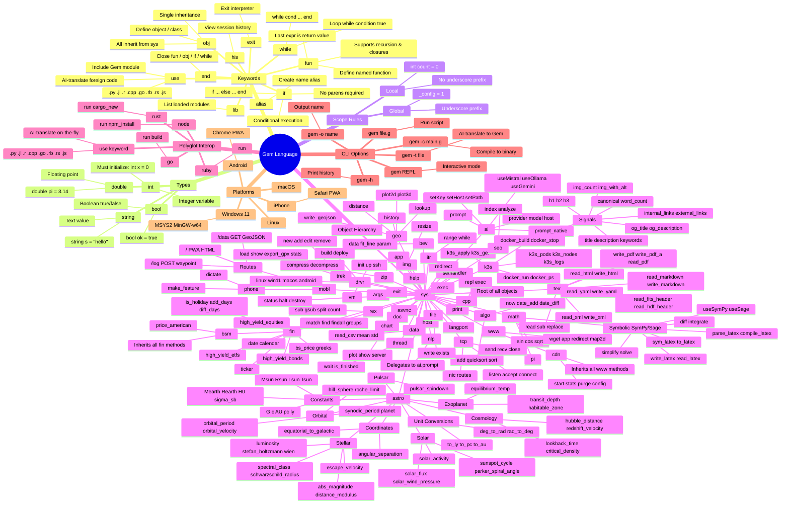

# Gem Language Mindmap

**Version:** 0.1.0 | **Date:** 2026-04-16 | **Copyright:** David B Hon 2025, 2026

---

## Object Inheritance Diagram

```mermaid
graph TD
    sys["sys (root)"]
    math["math"]
    ai["ai"]
    text["text"]
    geo["geo"]
    astro["astro"]
    fin["fin"]
    bsm["bsm (extends fin)"]
    chart["chart"]
    data["data"]
    rex["rex"]
    algo["algo"]
    tcp["tcp"]
    thread["thread"]
    www["www"]
    cdn["cdn (extends www)"]
    nlp["nlp"]
    bev["bev"]
    file["file"]
    zip["zip"]
    img["img"]
    cpp["cpp"]
    itr["itr"]
    k3s["k3s"]
    vm["vm"]
    mobl["mobl"]
    trek["trek"]
    seo["seo"]
    drvr["drvr"]
    go["go"]
    ruby["ruby"]
    node["node"]
    rust["rust"]

    sys --> math
    sys --> ai
    sys --> text
    sys --> geo
    sys --> astro
    sys --> fin
    fin --> bsm
    sys --> chart
    sys --> data
    sys --> rex
    sys --> algo
    sys --> tcp
    sys --> thread
    sys --> www
    www --> cdn
    sys --> nlp
    sys --> bev
    sys --> file
    sys --> zip
    sys --> img
    sys --> cpp
    sys --> itr
    sys --> k3s
    sys --> vm
    sys --> mobl
    sys --> trek
    sys --> seo
    sys --> drvr
    sys --> go
    sys --> ruby
    sys --> node
    sys --> rust
```

---

## Keyword Quick Reference

| Keyword | Purpose | Example |
|---------|---------|---------|
| `fun` | Define function | `fun add(a,b) a+b end` |
| `obj` | Define object/class | `obj Dog(name) : Animal ... end` |
| `use` | Import or translate foreign code | `use "script.py"` |
| `if` | Conditional | `if x > 0 ... else ... end` |
| `while` | Loop | `while i < 10 ... end` |
| `end` | Close block | closes `fun`/`obj`/`if`/`while` |
| `alias` | Name alias | `alias myprint = sys.print` |
| `his` | Session history | `his` |
| `lib` | List modules | `lib` |
| `exit` | Exit interpreter | `exit` |

## Type Quick Reference

| Type | Declaration | Notes |
|------|-------------|-------|
| `int` | `int x = 0` | Integer; must initialize |
| `double` | `double pi = 3.14` | Float; must initialize |
| `string` | `string s = "hi"` | Text; must initialize |
| `bool` | `bool ok = true` | Boolean; must initialize |
| `_var` | `_config = 1` | Underscore prefix = global scope |

## Builtin Module Summary (34 total)

| Module | Domain | Key Functions |
|--------|--------|---------------|
| `sys` | System root | `print`, `async`, `exec`, `app`, `help` |
| `math` | Math + symbolic | `sin`, `diff`, `integrate`, `compile_latex` |
| `ai` | AI/LLM | `prompt`, `useMistral`, `useOllama` |
| `text` | Documents | `read`, `write_pdf`, `read_yaml`, `read_xml` |
| `geo` | GIS | `lookup`, `distance`, `plot2d`, `plot3d` |
| `astro` | Astrophysics | `luminosity`, `orbital_period`, `hubble_distance` |
| `fin` | Finance | `ticker`, `bs_price`, `greeks` |
| `bsm` | Options | `price_american` (extends `fin`) |
| `chart` | Plotting | `plot`, `show`, `server` |
| `data` | Data science | `read_csv`, `mean`, `std` |
| `rex` | Regex | `match`, `findall`, `gsub`, `split` |
| `algo` | Algorithms | `quicksort`, `now`, `date_add` |
| `tcp` | Networking | `listen`, `connect`, `send`, `recv` |
| `thread` | Concurrency | `wait`, `is_finished` |
| `www` | Web server | `app`, `wget`, `redirect` |
| `cdn` | Caching proxy | `start`, `stats`, `purge` (extends `www`) |
| `nlp` | NLP | delegates to `ai.prompt` |
| `bev` | Curve fitting | `data`, `fit_line`, `param` |
| `file` | Filesystem | `write`, `exists` |
| `zip` | Compression | `compress`, `decompress` |
| `img` | Images | `resize` |
| `cpp` | C++ JIT | `exec`, `repl` |
| `itr` | Iterators | `range`, `while` |
| `k3s` | Docker/K8s | `docker_run`, `k3s_pods` |
| `vm` | Vagrant VMs | `init`, `up`, `ssh`, `halt` |
| `mobl` | Mobile PWA | `phone`, `dictate`, `make_feature` |
| `trek` | Travel logs | `new`, `add`, `show`, `export_gpx` |
| `seo` | SEO analysis | `index`, `analyze` |
| `drvr` | Device drivers | `linux`, `win11`, `macos`, `android` |
| `go` | Go polyglot | `run`, `build` |
| `ruby` | Ruby polyglot | `run` |
| `node` | Node.js polyglot | `run`, `npm_install` |
| `rust` | Rust polyglot | `run`, `cargo_new` |
