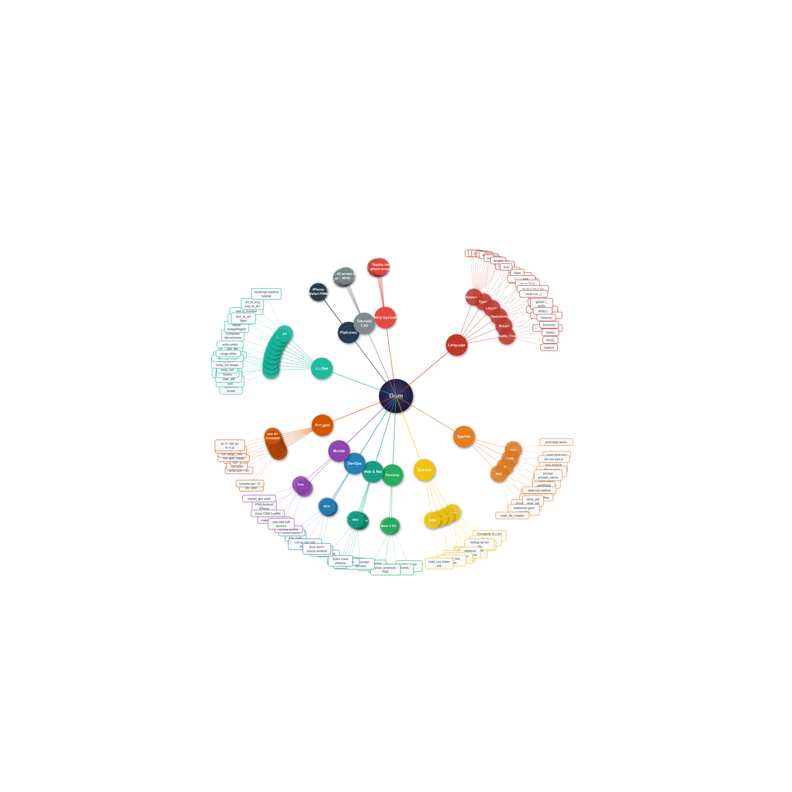

# David B Hon Hard Science Gem Language Copywrite 2025, 2026

**Version:** 0.1.0 | **Date:** 2026-04-16 | **Built with:** Gemini CLI & Kiro CLI

Welcome to the **Gem Language** — a modern, expressive STEM language built by Gemini-CLI and Kiro-CLI using C++26 for AI, scientific computing, quantitative finance, and cross-platform application development.

## Language Mindmap

<!-- Static render (GitHub, npm, etc.) -->


<details>
<summary>🔍 Interactive mindmap — drag to pan, scroll to zoom</summary>

<div style="overflow:hidden;border:1px solid #333;border-radius:8px;">



> Open [../docs/gem_mindmap.svg](../docs/gem_mindmap.svg) directly in a browser for the fully interactive pan/zoom version.

</div>
</details>

## Key Features

- **Explicit Typing with Initial Values**: All variable declarations require an initial value (`int x = 0`).
- **Global vs. Local Scope**: Variables starting with `_` (e.g., `_config`) are global; all others are local.
- **Universal Inheritance**: Every object inherits from `sys`, giving immediate access to `sys.print`, etc.
- **First-Class AI Support**: Built-in `ai` object supports Gemini, Mistral, and Ollama.
- **Polyglot Interop**: `use` keyword bridges Python, Julia, R, Fortran, C++, Go, Ruby, Rust, Node.js on-the-fly. Native execution via `python.run()`, `python.compile()`, `cython.build()`, `go.run()`, etc.
- **Mobile & Cross-Platform**: `mobl` object + browser PWA (Web Speech + Geolocation) works on Android, iPhone, macOS, Linux, and Windows 11.
- **Domain-Specific Built-ins**: `fin`, `bsm`, `bev`, `geo`, `data`, `chart`, `mobl`, `trek`, `astro`, `nlp`, `www`, `cdn`, `thread`, `rex`, `seo`, `drvr`, `art` built into the runtime.
- **Regular Expressions**: `rex` builtin provides full ECMAScript regex — match, find, findall, groups, sub, gsub, split, count.
- **Symbolic Math**: `math` builtin supports symbolic differentiation, integration, simplification, and LaTeX output via SymPy/Sage.
- **Astrophysics**: `astro` builtin covers stellar physics, orbital mechanics, cosmology, solar physics, and exoplanets.

---

## Tutorial Roadmap

### 1. The Foundations
- **[01_basics.g](01_basics.g)**: Variables, types, and basic I/O using the `sys` object.
- **[02_math_latex.g](02_math_latex.g)**: Arithmetic operations and LaTeX-style mathematical expressions.
- **[03_text_pdf.g](03_text_pdf.g)**: Text manipulation and PDF document generation.
- **[04_images.g](04_images.g)**: Image processing with ImageMagick.
- **[05_geo_gis.g](05_geo_gis.g)**: GIS, geolocation, GeoJSON, and interactive maps.

### 2. Application Development
- **[06_web_apps.g](06_web_apps.g)**: Building web servers with `sys.app()` and route handlers.
- **[07_ai_nlp.g](07_ai_nlp.g)**: NLP and AI prompting with Gemini, Mistral, and Ollama.
- **[08_functions.gm](08_functions.gm)**: Defining functions, objects, and inheritance.
- **[09_module_demo.g](09_module_demo.g)**: Structuring code with modules.
- **[11_modules_paths.g](11_modules_paths.g)**: Managing module resolution and import paths.

### 3. Advanced Integration & AI
- **[10_interop_cpp.g](10_interop_cpp.g)**: High-performance C++ interoperability via Cling JIT.
- **[12_lib_management.g](12_lib_management.g)**: Dependency management and library linking.
- **[13_dependency_details.g](13_dependency_details.g)**: Deep dive into Gem's package ecosystem.
- **[14_ai_providers.g](14_ai_providers.g)**: Using Gemini, Mistral, and Ollama side-by-side.
- **[15_mistral_native.g](15_mistral_native.g)**: Native Mistral C++ bridge via `prompt_native`.

### 4. Specialized Tooling
- **[16_algo_text_extras.g](16_algo_text_extras.g)**: Advanced string algorithms and text analysis.
- **[17_repl_features.g](17_repl_features.g)**: Mastering the interactive Gem REPL.
- **[18_tcp_sockets.g](18_tcp_sockets.g)**: Low-level networking fundamentals.
- **[19_tcp_server.g](19_tcp_server.g)** & **[20_tcp_client.g](20_tcp_client.g)**: Client-server architectures.
- **[21_polyglot.g](21_polyglot.g)**: Bridging Python, Julia, and Gem.

### 5. Science, Finance & DevOps
- **[22_builtins_itr_tcp.g](22_builtins_itr_tcp.g)**: Iterators and network protocols.
- **[23_data_science.g](23_data_science.g)**: DataFrames, statistics, and visualization.
- **[24_devops.g](24_devops.g)**: Automation scripts and infrastructure management.
- **[25_ollama_mistral.g](25_ollama_mistral.g)**: Running local LLMs via Ollama.
- **[26_devops_containers_vms.g](26_devops_containers_vms.g)**: Docker and Vagrant environments.

### 6. High-Performance & Symbolic Math
- **[27_rust_node.g](27_rust_node.g)**: Polyglot support for Rust and Node.js.
- **[28_interactive_charts.g](28_interactive_charts.g)**: Dynamic 2D/3D/multi-axes Plotly visualization.
- **[29_quantlib_finance.g](29_quantlib_finance.g)**: Quantitative finance with QuantLib.
- **[30_bsm_pde_inheritance.g](30_bsm_pde_inheritance.g)**: Black-Scholes-Merton PDE solvers.
- **[31_history_and_compilation.g](31_history_and_compilation.g)**: Gem's compilation model and history.
- **[32_symbolic_math.g](32_symbolic_math.g)**: Symbolic differentiation and integration.
- **[33_langport_porting.g](33_langport_porting.g)**: Porting legacy codebases to Gem.
- **[34_geo_tectonics.g](34_geo_tectonics.g)**: Advanced GIS, tectonic modeling, and geo-visualization.
- **[35_text_advanced.g](35_text_advanced.g)**: Large-scale text processing and indexing.

### 7. Mobile & Cross-Platform
- **[36_mobl_travel_log.g](36_mobl_travel_log.g)**: `mobl` object — NLP dictation + GPS + GeoJSON travel log PWA.

### 8. System Programming & Hardware
- **[37_device_drivers.g](37_device_drivers.g)**: `drvr` builtin — Linux, Windows 11, macOS, and Android device driver development.

### 9. Text & Pattern Matching
- **[38_rex.g](38_rex.g)**: `rex` builtin — full ECMAScript regular expressions: match, find, findall, groups, sub, gsub, split, count.

### 10. Travel Logs & OSM Mapping
- **[39_trek.g](39_trek.g)**: `trek` builtin — create, display, and edit travel logs on OpenStreetMap with GeoJSON/GPX support.

### 11. Search Engine Optimization
- **[40_seo.g](40_seo.g)**: `seo` builtin — crawl URLs, extract SEO signals (title, meta, headings, links), write JSON index, and print analysis report.

### 12. ASCII Art & SVG
- **[41_art.g](41_art.g)**: `art` builtin — generate ASCII art from text, convert to/from SVG, render mindmap/README/tutorial as ASCII art.

### 13. Python & Cython Polyglot
- **[42_python_cython.g](42_python_cython.g)**: `python` and `cython` builtins — run/compile Python scripts, byte-compile `.py` → `.pyc`, transpile `.pyx` → C → `.so` native extension, pip package management.

### 14. Heterogeneous Arrays & Dictionaries
- **[43_arrays_dicts.g](43_arrays_dicts.g)**: `algo.array` and `algo.dict` — allocate and manipulate heterogeneous multidimensional arrays of arbitrary content, and dictionary objects with arbitrary key/value tuples. Covers 1-D arrays, N-D matrices, dict basics, dict-of-arrays, and array-of-dicts table patterns.

---

## Help & Builtins

```text
--- Gem Language Help ---
Gem is a high-performance STEM language implemented in C++26.

Usage Tips:
  - All variables must be initialized: 'int x = 0'
  - Global variables start with underscore: '_config = 1'
  - Use 'use "file.py"' to translate and run foreign code.
  - Use 'langport("*.py", "out.gm")' to port and save code.
  - Use 'lib' to see all loaded modules.
  - Use 'his' to view today's session history.

CLI Options:
  gem <file.g>              - Run a script.
  gem -c <main.g> [mod...]  - Compile multiple files into a binary.
  gem -o <name>             - Specify output name for compiler.
  gem -h                    - Print history and exit.
  gem -t <file> [-o output] - AI-assisted translation to Gem.

Available Builtin Modules:
  sys, math, ai, text, rex, algo, bev, file, zip, nlp, img, www, cdn, geo,
  cpp, tcp, itr, thread, data, k3s, vm, go, ruby, node, rust,
  python, cython,
  fin, bsm, chart, astro, mobl, trek, seo, drvr, art

Keywords for Documentation:
  fun, obj, use, alias, his, lib, end, if, else, while,
  int, double, string, bool, exit, quit, langport,
  true, false, null, nil, nan

Builtin Functions:
  isnil(x)  isnan(x)  tonum(x)  tostr(x)  len(x)  type(x)

Operators:
  Arithmetic:   +  -  *  /
  Compound:     +=  -=  *=  /=
  Comparison:   ==  !=  >  >=  <  <=
  Logical:      !  (prefix not)  &&  ||
  Separator:    ;  (multiple statements per line)
  String concat: +

Mobile & Cross-Platform:
  mobl phone("name")  phone.dictate(text)  phone.make_feature(lat,lon,text)
  ./gem travel_log.g  →  http://localhost:8080  (Android/iPhone/macOS/Linux/Win11)

Detailed help: help "topic"  or  help(topic)
Full reference: helpfull  or  sys.helpfull()  (writes helpfull_DATETIME.md, opens in viewer)
Paged reference: helpless  or  sys.helpless()  (writes helpfull_DATETIME.md, pipes through less)
```

---

## Builtin Functions & Literals

| Item | Type | Description |
|------|------|-------------|
| `true` | literal bool | Boolean true |
| `false` | literal bool | Boolean false |
| `null` / `nil` | literal void | Null/void value (interchangeable) |
| `nan` | literal double | IEEE 754 Not-a-Number |
| `isnil(x)` | function | `→ bool` — true if x is nil/null/void |
| `isnan(x)` | function | `→ bool` — true if x is NaN |
| `tonum(x)` | function | `→ double` — parse to number; nan on failure |
| `tostr(x)` | function | `→ string` — convert to string |

## Builtin Module Reference

### sys — System Root Module
Every object inherits from `sys`. Methods:
- `sys.print(...)` — print to stdout
- `sys.args()` — CLI args as vector
- `sys.async(func, [params], [timeout])` — background thread; returns thread handle
- `sys.sethandler(signals, func)` — custom signal handler
- `sys.host()` — OS info string
- `sys.exec(cmd)` — run shell command
- `sys.doc([path])` — read file comments
- `sys.help([topic])` — interactive help (with cross-language comparisons)
- `sys.exit()` — exit interpreter
- `sys.langport(pattern, [output])` — AI-port foreign code to Gem
- `sys.redirect(url, [port])` — HTTP redirect server
- `sys.app(port, [routes])` — background HTTP server

Comparisons: C++=`std::cout/std::thread/signal()` · Python=`print/threading/signal` · Julia=`println/@async` · Go=`fmt.Println/goroutine` · Ruby=`puts/Thread.new` · Rust=`println!/std::thread::spawn`

### math — Mathematics & Symbolic Math
Standard: `sin(x)`, `cos(x)`, `sqrt(x)`, `math.pi`

Symbolic (SymPy/Sage backend):
- `math.useSymPy()`, `math.useSage()` — switch backend
- `math.diff(expr, [var])` — symbolic derivative
- `math.integrate(expr, [var])` — symbolic integral
- `math.simplify(expr)`, `math.solve(expr, [var])`
- `math.sym_latex(expr)`, `math.to_latex(val)`, `math.write_latex(path, content)`
- `math.read_latex(path)`, `math.parse_latex(text)`, `math.compile_latex(path)`

Comparisons: C++=`<cmath>/GiNaC` · Python=`math/sympy` · Julia=`sin()/Symbolics.jl` · Go=`math.Sin()` · Ruby=`Math::sin()` · Rust=`f64::sin()`

### ai — AI Integration
Supports Gemini (default), Mistral, Ollama:
- `ai.prompt(text)` — send prompt to current provider
- `ai.prompt_native(text)` — Mistral C++ bridge (requires `mistralai` >= 1.0, Python 3.14)
- `ai.useMistral(model)`, `ai.useOllama(model, [host])`, `ai.useGemini()`
- `ai.setKey(key)`, `ai.setHost(host)`, `ai.setPath(path)`
- Properties: `provider`, `model`, `host`

Comparisons: C++=`libcurl+json` · Python=`google-generativeai/mistralai` · Julia=`HTTP.jl` · Go=`generative-ai-go` · Ruby=`ruby-openai` · Rust=`async-openai`

### text — String & Document Processing
- `text.read(path)`, `text.sub(s, start, [len])`, `text.replace(s, old, new)`
- `text.write_pdf(path, text)`, `text.write_pdf_a(path, text)`, `text.read_pdf(path)`
- `text.read_markdown/write_markdown`, `text.read_yaml/write_yaml`
- `text.read_html/write_html`, `text.read_xml/write_xml`
- `text.read_fits_header(path)`, `text.read_hdf_header(path)`

Comparisons: C++=`std::string/fstream/pugixml` · Python=`str/pypdf/pyyaml/lxml` · Julia=`String/YAML.jl` · Go=`strings/encoding/xml` · Ruby=`String/prawn/nokogiri` · Rust=`String/lopdf/quick-xml`

### geo — GIS & Geolocation
- `geo.lookup()` — IP geolocation (`.lat`, `.lon`, `.city`, `.country`)
- `geo.distance(lat1, lon1, lat2, lon2)` — Haversine distance in km
- `geo.write_geojson(path, features)`, `geo.history(plate)` — tectonic history (AI)
- `geo.plot2d(data, [layout])` — 2D Plotly/OSM map
- `geo.plot3d(data, [layout])` — 3D globe

Comparisons: C++=`GDAL/GEOS` · Python=`geopandas/folium/geopy` · Julia=`GeoStats.jl` · Go=`paulmach/orb` · Ruby=`rgeo` · Rust=`geo crate`

### astro — Astrophysics & Planetary Science
Constants: `G`, `c`, `AU`, `pc`, `ly`, `Msun`, `Rsun`, `Lsun`, `Tsun`, `Mearth`, `Rearth`, `H0`, `sigma_sb`

Unit conversions: `to_ly(pc)`, `to_pc(ly)`, `to_au(m)`, `deg_to_rad(d)`, `rad_to_deg(r)`

Stellar: `luminosity(R,T)`, `stefan_boltzmann(T,R)`, `wien(T)`, `abs_magnitude(m,d_pc)`,
`distance_modulus(d_pc)`, `spectral_class(T)`, `schwarzschild_radius(M)`, `escape_velocity(M,R)`

Orbital: `orbital_period(a_au,M_msun)`, `orbital_velocity(a_m,M_kg)`, `hill_sphere(a,mp,ms)`,
`roche_limit(R,rho_p,rho_s)`, `synodic_period(p1,p2)`, `planet(name)` → Mercury…Neptune

Solar: `solar_flux(dist_au)`, `solar_wind_pressure(n_cm3,v_km_s)`, `sunspot_cycle(year)`,
`parker_spiral_angle(v_sw,dist_au)`, `solar_activity()`

Cosmology: `hubble_distance(z)`, `redshift_velocity(z)`, `lookback_time(z)`, `critical_density()`

Coordinates: `equatorial_to_galactic(ra,dec)`, `angular_separation(ra1,dec1,ra2,dec2)`

Exoplanet: `transit_depth(rp_rearth,rs_rsun)`, `habitable_zone(L_lsun)`, `equilibrium_temp(L,d,A)`

Pulsar: `pulsar_spindown(P_s, Pdot)` → `{age_yr, Bfield_G, edot_W}`

Comparisons: C++=`SOFA/ERFA` · Python=`astropy` · Julia=`AstroLib.jl` · Go=`soniakeys/meeus` · Ruby=`astronomy gem` · Rust=`astro crate`


### seo — Search Engine Optimization
- `seo.index(urls, output_path)` — crawl list of URLs, extract SEO signals, write JSON index
- `seo.analyze(index_path)` — load index JSON and print SEO report to stdout

Signals extracted: `title`, `description`, `keywords`, `og:title`, `og:description`, `canonical`, `word_count`, `img_count`, `img_with_alt`, `internal_links`, `external_links`, `h1`/`h2`/`h3` headings

Comparisons: C++=`libcurl+custom parser` · Python=`scrapy/beautifulsoup4` · Julia=`HTTP.jl/Gumbo.jl` · Go=`colly/goquery` · Ruby=`nokogiri/mechanize` · Rust=`scraper/reqwest`

### art — ASCII Art & SVG
- `art.text_to_art(text, [font])` — render text as ASCII art via figlet/toilet (fallback: box)
- `art.art_to_file(text, path)` — write ASCII art string to a text file
- `art.art_to_svg(text, [path])` — convert ASCII art to SVG; returns SVG string
- `art.svg_to_art(svg_path, [width])` — convert SVG to ASCII art via rsvg-convert + jp2a
- `art.mindmap([path])` — render `docs/gem_mindmap.md` as ASCII art (mermaid mindmap)
- `art.readme([path])` — render `README.md` headings as ASCII art summary
- `art.tutorial([path])` — render `tutorial/README.md` as ASCII art summary

Optional deps: `figlet`/`toilet` (text→art) · `mmdc` (mermaid CLI) · `rsvg-convert`+`jp2a` (SVG→art)

Comparisons: C++=`libaa/figlet CLI` · Python=`pyfiglet/ascii_magic` · Julia=`no built-in` · Go=`no built-in` · Ruby=`artii gem` · Rust=`figlet-rs crate`

### trek — Travel Logs & OSM Mapping
- `trek.new(path)` — create empty GeoJSON travel log
- `trek.add(path, lat, lon, [title], [note])` — append waypoint
- `trek.edit(path, index, title, note)` — update waypoint at index
- `trek.remove(path, index)` — remove waypoint at index
- `trek.load(path)` — return GeoJSON string
- `trek.show(path, [port])` — serve interactive OSM/Leaflet map with live edit UI (default port 8090)
- `trek.export_gpx(geojson_path, gpx_path)` — export to GPX
- `trek.stats(path)` — returns `{.waypoints, .distance_km}`

Comparisons: C++=`GDAL/libgpx` · Python=`gpxpy/folium` · Julia=`GPX.jl` · Go=`tkrajina/gpxgo` · Ruby=`gpx gem` · Rust=`gpx crate`

### mobl — Mobile & Cross-Platform PWA
```
mobl phone("device_name")
phone.dictate(spoken_text)          # NLP parse → JSON {title, note, tags}
phone.make_feature(lat, lon, text)  # GPS + dictation → GeoJSON Feature
```
Browser supplies GPS (Geolocation API) + speech (Web Speech API). Gem server handles NLP, GeoJSON assembly, and file persistence.

Routes: `/` → PWA HTML, `/log` → POST `{lat,lon,text}`, `/data` → GET GeoJSON FeatureCollection

Comparisons: C++=`Qt` · Python=`Flask+SpeechRecognition` · Julia=`no built-in` · Go=`net/http+custom JS` · Ruby=`Rails+Web Speech` · Rust=`actix-web+custom JS`

### fin — Financial Engineering
- `fin.ticker(symbol)` — real-time market data via yfinance → `{.price,.volume,.open,.high,.low,.close,.pe_ratio,.market_cap,.dividend_yield}`
- `fin.high_yield_bonds()`, `fin.high_yield_etfs()`, `fin.high_yield_equities()` — top 50 from TradingView
- `fin.dashboard()` — serve financial dashboard on port 8082
- `fin.bs_price(type, strike, spot, rate, vol, t)` — European option pricing → double
- `fin.greeks(type, strike, spot, rate, vol, t)` → `{.npv, .delta, .gamma, .theta, .vega}`
- `fin.date(d,m,y)` → `{.day,.month,.year,.serial,.str}`, `fin.calendar(name)`, `fin.is_holiday(cal,d,m,y)→bool`, `fin.add_days(d,m,y,n)→{.day,.month,.year,.str}`, `fin.diff_days(d1,m1,y1,d2,m2,y2)→double`

Comparisons: C++=`QuantLib` · Python=`yfinance/quantlib-python` · Julia=`MarketData.jl/QuantLib.jl` · Go=`piquette/quantlib` · Ruby=`quantlib-ruby` · Rust=`ta crate`

### bsm — Black-Scholes-Merton
Inherits all `fin` methods, plus:
- `bsm.price_american(symbol, type, duration)` — PDE-enhanced American option pricing (`weekly`/`monthly`/`quarterly`)

Comparisons: C++=`QuantLib FDBlackScholesVanillaEngine` · Python=`quantlib-python AmericanOption` · Julia=`QuantLib.jl AmericanExercise`

### chart — Interactive Plotting (Plotly.js)
- `chart.plot(traces, [layout])` — generate interactive HTML chart
- `chart.show(path)` — open chart in browser
- `chart.server(path, [port])` — serve chart via background HTTP server

Comparisons: C++=`matplotlib-cpp/ROOT` · Python=`plotly/matplotlib/seaborn` · Julia=`Plots.jl/Makie.jl` · Go=`gonum/plot` · Ruby=`gruff` · Rust=`plotters crate`

### data — Data Science
- `data.read_csv(path)` — read CSV into vector of row objects
- `data.mean(vector)` — arithmetic mean
- `data.std(vector)` — sample standard deviation

Comparisons: C++=`Eigen/Armadillo` · Python=`pandas/numpy` · Julia=`DataFrames.jl/CSV.jl` · Go=`gonum/stat` · Ruby=`daru gem` · Rust=`polars crate`

### rex — Regular Expressions (ECMAScript)
All functions accept optional flags string (`"i"` = case-insensitive):
- `rex.match(text, pattern, [flags])` → bool
- `rex.find(text, pattern, [flags])` → first match string
- `rex.findall(text, pattern, [flags])` → list of all matches
- `rex.groups(text, pattern, [flags])` → capture groups from first match
- `rex.sub(text, pattern, repl, [flags])` → replace first match
- `rex.gsub(text, pattern, repl, [flags])` → replace all matches
- `rex.split(text, pattern, [flags])` → split on pattern
- `rex.count(text, pattern, [flags])` → count non-overlapping matches

Comparisons: C++=`std::regex` · Python=`re` · Julia=`Regex/match()` · Go=`regexp` · Ruby=`=~/gsub` · Rust=`regex crate`

### algo — Algorithms, Arrays & Dictionaries
- `algo.add(...)` — sum all numeric arguments
- `algo.quicksort(v)`, `algo.sort(v, [start], [end])` — sort numeric vectors
- `algo.now()` — current local time as string
- `algo.date_add(ts, days)`, `algo.date_diff(t1, t2)` — date arithmetic
- `algo.array([d1,d2,...], [fill])` — allocate heterogeneous N-D array; fill default nil
- `algo.array_get(arr, i0, i1, ...)` — index into nested array
- `algo.array_set(arr, val, i0, i1, ...)` — set element in-place
- `algo.array_push(arr, val)` — append to 1-D array
- `algo.array_len(arr)` — outermost dimension length
- `algo.array_shape(arr)` — dimensions as numeric vector
- `algo.dict([k,v,...])` — create dictionary, optional initial key/value pairs
- `algo.dict_set(d, key, val)` — set key (mutates in-place)
- `algo.dict_get(d, key)` — get value by key (nil if missing)
- `algo.dict_del(d, key)` — remove key
- `algo.dict_has(d, key)` — existence check
- `algo.dict_keys(d)` — all keys as string vector
- `algo.dict_vals(d)` — all values as heterogeneous array
- `algo.dict_len(d)` — entry count

Comparisons: C++=`std::sort/std::chrono/std::vector<std::any>/std::map` · Python=`sorted()/datetime/list/dict` · Julia=`sort!()/Dates/Any[]/Dict` · Go=`sort.Slice/time/[]interface{}/map` · Ruby=`Array#sort!/Time/Array/Hash` · Rust=`slice.sort/SystemTime/Vec<Box<dyn Any>>/HashMap`

### tcp — TCP/IP Networking
- `tcp.listen(port)→int` — bind server socket
- `tcp.accept(fd)→{.fd,.addr}` — block for client connection
- `tcp.connect(host, port)→int` — connect to server
- `tcp.send(fd, msg)→int` — send string, returns bytes sent
- `tcp.recv(fd, [size])→string` — receive data (default size 4096)
- `tcp.close(fd)→bool` — close socket
- `tcp.nic()→[{.name,.ip,.status}]` — network interface list
- `tcp.routes()→[{.dest,.gw,.iface}]` — routing table

Comparisons: C++=`POSIX socket/bind/listen` · Python=`socket.socket` · Julia=`Sockets.listen` · Go=`net.Listen` · Ruby=`TCPServer` · Rust=`TcpListener::bind`

### thread — Background Threads
Returned by `sys.async()`. Methods on the thread handle:
- `thread.wait()` — block until complete, returns result (or timeout error string)
- `thread.is_finished()` — bool, non-blocking status check

Comparisons: C++=`std::future/std::async` · Python=`concurrent.futures.Future` · Julia=`@async/fetch()` · Go=`goroutine+channel` · Ruby=`Thread#join/alive?` · Rust=`JoinHandle#join`

### www — Web Framework
- `www.wget(url, file)` — download file via curl
- `www.app(port, [routes])` — background HTTP server; routes map paths to HTML strings
- `www.redirect(target, [port])` — start redirect server or return redirect header string
- `www.map2d(geojson, output)` — render 2D map via Mapnik (requires HAS_MAPNIK)

Comparisons: C++=`cpp-httplib/Crow` · Python=`Flask/FastAPI` · Julia=`HTTP.jl/Genie.jl` · Go=`net/http/Gin` · Ruby=`Sinatra/Rails` · Rust=`actix-web/axum`

### cdn — Caching Proxy Server
Inherits all `www` methods, plus:
- `cdn.start(port, routes_map)` — start caching reverse-proxy; routes map path prefixes to origin URLs
- `cdn.stats()` — returns object with `.hits`, `.misses`, `.bytes`, `.cached_items`
- `cdn.purge([path])` — evict one path or `"*"` to clear entire cache
- `cdn.config(type, content)` — generate nginx/apache config
- `cdn.dashboard()` — serve CDN stats dashboard on port 8083

Comparisons: C++=`nginx/Varnish` · Python=`no built-in` · Julia=`no built-in` · Go=`groupcache` · Ruby=`rack-cache` · Rust=`no built-in`

### k3s — Docker & Kubernetes
- `k3s.docker_run(image, cmd)`, `k3s.docker_ps()`, `k3s.docker_build(path, tag)`, `k3s.docker_stop(id)`
- `k3s.k3s_apply(yaml)`, `k3s.k3s_get(resource)`, `k3s.k3s_pods()`, `k3s.k3s_nodes()`, `k3s.k3s_logs(pod)`

Comparisons: C++=`Docker SDK/HTTP API` · Python=`docker-py/kubernetes` · Julia=`no official SDK` · Go=`docker/client/k8s.io/client-go` · Ruby=`docker-api/kubeclient` · Rust=`bollard/kube-rs`

### vm — Vagrant VMs
- `vm.init(box)`, `vm.up()`, `vm.ssh(cmd)`, `vm.status()`, `vm.halt()`, `vm.destroy()`

Comparisons: C++=`libvirt C API` · Python=`python-vagrant` · Julia=`no official bindings` · Go=`os/exec` · Ruby=`Vagrant is Ruby` · Rust=`std::process::Command`

### drvr — Device Driver Development
- `drvr.linux(name)`, `drvr.win11(name)`, `drvr.macos(name)`, `drvr.android(name)` — generate driver templates
- `drvr.build(target)`, `drvr.deploy(target)` — cross-platform build and deploy

Comparisons: C++=`Linux module_init/WDK/WDF` · Python=`ctypes/cffi (userspace only)` · Julia=`no support` · Go=`TinyGo (embedded)` · Ruby=`no support` · Rust=`linux-kernel-module-rust`

### Other Builtins
- **`nlp`** — Natural Language Processing (delegates to `ai.prompt()`). C++=`OpenNLP` · Python=`nltk/spacy` · Julia=`TextAnalysis.jl` · Rust=`rust-bert`
- **`bev`** — Bevington data reduction: `data(x,y)`, `fit_line()`, `param(idx)`. C++=`GSL` · Python=`numpy.polyfit` · Julia=`GLM.jl` · Rust=`linregress`
- **`file`** — `file.write(path, content)`, `file.exists(path)`. C++=`std::filesystem` · Python=`open/os.path` · Julia=`write/isfile` · Rust=`std::fs`
- **`zip`** — `zip.compress(src, archive)`, `zip.decompress(archive, dest)`. C++=`libzip/miniz` · Python=`zipfile` · Julia=`ZipFile.jl` · Rust=`zip crate`
- **`img`** — `img.resize(src, width, height, dest)`. C++=`Magick++` · Python=`Pillow` · Julia=`Images.jl` · Rust=`image crate`
- **`cpp`** — `cpp.repl()`, `cpp.exec(code)` — C++26 JIT via Cling. Python=`ctypes/pybind11` · Julia=`Cxx.jl` · Rust=`bindgen`
- **`itr`** — `itr.range(n)`, `itr.while(cond_fun, body_fun)`. C++=`std::ranges::iota` · Python=`range()` · Julia=`1:n` · Rust=`0..n`
- **`go`**, **`ruby`**, **`node`**, **`rust`** — polyglot `run(input)` + `go.build()`, `node.npm_install()`, `rust.cargo_new()`

---

## Mobile Travel Log App

```bash
./gem travel_log.g          # start server on :8080
# Android/iPhone → http://<host-ip>:8080
# macOS/Linux/Win11 → http://localhost:8080
```

Uses the `mobl` builtin + `travel_log.html` (PWA). Voice dictation → AI NLP → GPS pin → live GeoJSON → Plotly map.

---

## Getting Started

### Prerequisites

- **macOS/Linux**: `g++` (C++26), `make`, `python3` (3.14+), `libreadline-dev`. Python 3.14 headers required for embedded polyglot runtime.
- **Windows 11**: [MSYS2](https://www.msys2.org/) with `mingw-w64-x86_64-gcc`, `make`, and `mingw-w64-x86_64-python`. Ensure `C:\msys64\mingw64\bin` is in your PATH.

### Build and Run

```bash
make all
./gem tutorial/01_basics.g
```

On Windows, the binaries will be produced as `gem.exe` and `gem_test.exe`.

---

## Windows Support

Gem is now fully compatible with Windows 11 via MSYS2/MinGW-w64. Key improvements include:
- **Robust Dependency Detection**: Automatic detection of Python headers and libraries using `sysconfig`.
- **Modern API Integration**: Support for `cpp-httplib` and other libraries through `_WIN32_WINNT=0x0A00`.
- **Cross-Platform Signals**: Graceful handling of platform-specific signals (`SIGINT`, `SIGTERM`).
- **Path Compatibility**: Seamless handling of Windows-style paths and `.exe` extensions in compilation mode.

Or enter the REPL:
```bash
./gem
```

---
*Developed with Gemini CLI and Kiro.*
